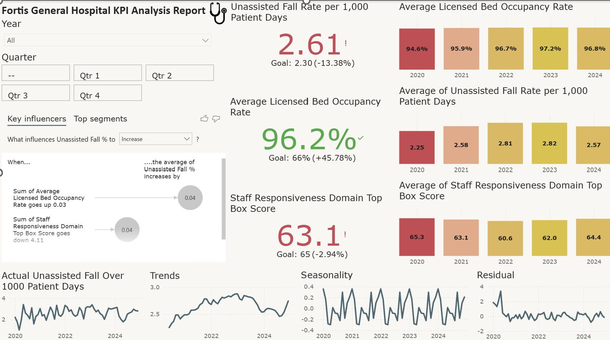

# 🏥 Fortis Healthcare Analytics (Capstone Simulation)

**Author:** Timsy Singh  
**Tools:** Power BI | Excel | Regression | Dashboarding

A simulation-based healthcare analytics project analyzing key hospital performance indicators using Power BI and Excel. This solo capstone-style case study reflects operational decision-making using realistic healthcare KPIs over a modeled 20-year period.

---

## 🎯 Objective

To identify and analyze operational inefficiencies in hospital services using key metrics:
- Unassisted Fall Rate per 1,000 Patient Days
- Staff Responsiveness Scores (HCAHPS)
- Average Bed Occupancy Rate

---

## 📊 Tools & Methods

- **Excel:** Data cleaning, KPI calculation, regression modeling
- **Power BI:** Dashboard creation and KPI visualization
- **Regression Analysis:** Simulated % improvements based on modeled correlations

---

## 📈 Key Findings

- A **strong negative correlation (-0.79)** between staff responsiveness and patient falls
- **High bed occupancy** is associated with increased fall rates and lower staff responsiveness
- Regression analysis explained **62.6%** of the variance in fall rates

---

## 💡 Strategic Recommendations

- Increase seasonal staffing during peak occupancy periods  
- Train staff to improve response time  
- Add licensed beds to relieve overcrowding

---

## 📂 Files Included

| File | Description |
|------|-------------|
| `Fortis General Hospital.pptx` | Full slide presentation with analysis, charts, and KPIs |
| `Fortis General Hospital.pdf` | Print-ready version|
| `Fortis_Kpi_analysis.xlsx` | Raw or cleaned synthetic data |
|'fortis general hospital.pbix'| Dashboard and Visualisation |

## 📸 Sample Dashboard Previews

Here are snapshots of the Power BI dashboard included in the `.pbix` file:

### 🎯 KPI Overview

---

## ⚠️ Notes

- This is a **capstone simulation** — data is synthetic but modeled on realistic hospital KPI trends over 5 years, simulating 20 years of operational insight.
- Future versions will include Python and SQL for backend automation and dynamic reporting.

---

## 📬 Contact

**Timsy Singh**  
[LinkedIn →](https://www.linkedin.com/in/timsy-singh-44a21b1b1/)  
📧 singhtimsy33@gmail.com
